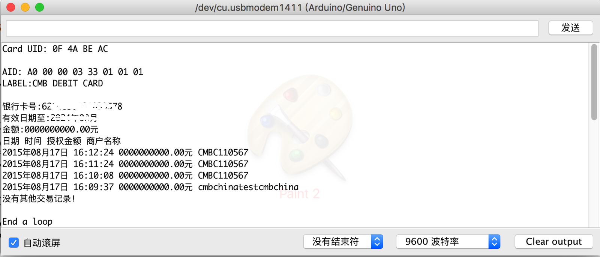

# PBOC-Arduino 

这是一个基于MFRC522库的扩展，支持PBOC（中国人民银行金融IC卡）的协议，并提供读取卡片的样例。
**欢迎大家给星~**
## 协议说明
PBOC是中国人民银行根据EMV规范指定的中国金融IC卡的规范，具体协议均在[/doc/PBOC2.0]()中。
协议在底层兼容iso-14443协议（具体见PBOC2.0第11部分），应用层兼容接触式IC卡的iso-7816传输协议。

## 内容简介
* PBOC类
	* 在底层的ISO-14443协议上增加应用层的处理
	* 支持PBOC的Select、ReadRecord、GetData等命令
	* 支持ISO-7816格式的Respond
	* 支持解析各阶段的返回数据
* utils
	* `byte addLen(byte len, byte* value, byte * buf, bool addzero = true);
`
	将长度加入字节串前端构成tlv结构数据
	* `byte concatBytes(byte l1, byte l2, byte* s1, byte* s2, byte* s3);
`
	连接两个字节串
	* `void dump_byte_array(byte *buffer, byte bufferSize);
`
	以16进制输出字节串
	* `int printUntil(byte* data, byte end = 0x00);`
	`int printHalfBytes(byte* data, int begin, byte len);`
	输出函数，按半字节输出直到某字符或固定长度，用来输出PBOC协议的某些信息
	* BytePool类，字节串内存池。所有字节串初始时建立好，通过release循环利用，极大节省空间。之所以不用动态内存是因为实测arduino对new等操作效果不好。
	* tlv结构体。构建tlv结构，注意的是为了节省空间，这里只记录指向tlv地址的指针，所以不能在使用结束之前释放原有内存块。
* 修正了MFRC522Extended中对于"链接块"的处理的BUG。 
	
## 使用说明
1. 下载库文件
2. 删除MFRC522库，以免产生冲突。为了兼容性本库保留MFRC522名字，之前程序大部分仍能照常运行，但是由于修复原来库中一些错误，略有冲突。
3. Ardinuo->项目->加载库->加载一个.ZIP库并选择该问文件夹
4. 使用示例中的readPBOC测试

## 运行截图

本图中只有开户记录，没有交易记录。
## 致谢
感谢邬晓钧、赵有健老师的帮助，感谢360杨卿、简云定老师的讲解。
